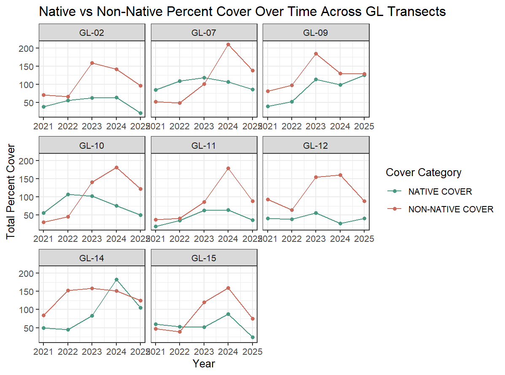
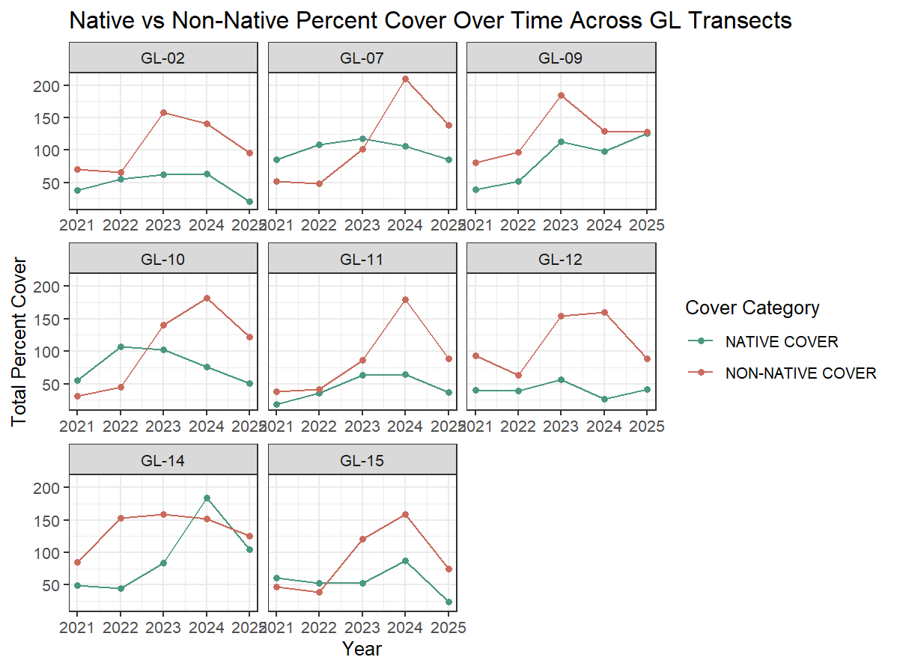

```{r}
#| label: load-packages

# general use
library(tidyverse)

# file organization
library(here)

# data visualization
library(naniar)
library(patchwork)
library(gghighlight)
```

```{r}
#| label: load-data
veg <- read_csv(here("data", "veg.csv"))

metadata <- read_csv(here("data", "vp_veg_metadata.csv"))
```

# Introduction

# Methods

To answer our research question, we used a vegetation dataset sourced from the Cheadle Center for Biodiversity and Ecological Restoration (CCBER), and provided to us by the ENVS 193DD course. This dataset spans 5 years (2021-2025) of vegetation data from across several habitats in North Campus Open Space (NCOS) including grasslands, mosaic habitats, wetlands, open water, woodlands, and shrublands.

We chose to focus on native perennial grasslands, which encompasses measurements from 8 different transects across the 16.8-acre mesa. The method of data collection used for vegetation surveys is the Quadrat Transects (QT) method. This method involves the use of 11 one-square-meter quadrats placed by a 30-meter transect, with quadrats alternating between the left and right side of the transect line every 3 meters. “The quadrats are subdivided into 100 ten-centimeter squares and the percent cover is estimated \[by human monitors\] for each species in the quadrat,” [@rickard2024].

We will not be performing a formal statistical analysis for our project because we are primarily exploring a correlative relationship rather than predicting trends for species cover and richness. However, we will be identifying major events that might influence a directional response in vegetation percent cover and species richness, and examining whether a response was captured in our dataset. Major events include the prescribed burn in Fall 2023 because of its effects as an intermediate disturbance event, as well as wet (2023, 2024) and dry (2021, 2022) water years because water is a limiting resource for key native grass species (S. pulchra). These factors are potential influences on how percent cover and species richness change over time.

# Results

```{r}
#| label: implicit-data
# create a new object from veg
gl_implicitNA <- veg |> 
  # filter all occurrences where transect_name contains GL
  filter(str_detect(transect_name, "GL") &
           site == "ncos") |> 
  # group by year, pool, and species
  group_by(year, transect_name, psoc) |>
  # calculate mean percent cover
  summarize(mean_pc = mean(percent_cover, na.rm = TRUE)) |> 
  # ungroup data frame
  ungroup() |> 
  # create a new column called year_pool from year and transect name
  unite("year_pool", year, transect_name, remove = TRUE) |>
  # join with metadata by year_pool
  left_join(metadata, by = "year_pool")
```

```{r}
#| label: explicit-data

# creating new object from veg
gl_explicit0 <- veg |> 
  # filter all occurrences where transect_name contains GL
  filter(str_detect(transect_name, "GL") &
           site == "ncos") |> 
  # complete all possible combinations of year, pool, psoc and distance
  complete(year, transect_name, psoc, transect_distance,
           # fill values of percent cover with 0
           fill = list(percent_cover = 0)
           ) |>
  # group by year, pool, and psoc
  group_by(year, transect_name, psoc) |>
  # calculate total percent cover across all quads
  summarize(sum_pc = sum(percent_cover, na.rm = TRUE)) |>
  # ungroup the data frame
  ungroup() |>
  # create a new column called year_pool from year and transect name
  unite("year_pool", year, transect_name, remove = TRUE) |> 
  # join with metadata data frame
  left_join(metadata, by = "year_pool") |> 
  # calculate mean percent cover from total percent cover/number of quadrats
  mutate(mean_pc = sum_pc/num_quad)
```

```{r}
#| label: alyssa wrangling for vis 1

gl_implicitNA_alyssa <- veg |> 
  # filter all occurrences where transect_name contains VP
  filter(str_detect(transect_name, "GL") &
           site == "ncos") |> 
  # group by year, pool, and species
  group_by(year, transect_name, psoc, cover_category) |>
  # calculate mean percent cover
  summarize(mean_pc = mean(percent_cover, na.rm = TRUE)) |> 
  # ungroup data frame
  ungroup() |> 
  # create a new column called year_pool from year and transect name
  unite("year_pool", year, transect_name, remove = TRUE) |>
  # join with metadata by year_pool
  left_join(metadata, by = "year_pool")


grass_cover <- gl_implicitNA_alyssa |>
  filter(cover_category %in% c("NATIVE COVER", "NON-NATIVE COVER"))

gl_transects <- gl_implicitNA_alyssa |>
  filter(
    transect_name %in% c("GL-02", "GL-07", "GL-09", "GL-10",
                         "GL-11", "GL-12", "GL-14", "GL-15"),
    cover_category %in% c("NATIVE COVER", "NON-NATIVE COVER"))
```

```{r}
#| label: native-vector

# creating new vector from veg
native_spp <- veg |> 
  # filter all occurrences where transect_name contains GL
  filter(str_detect(transect_name, "GL") &
           site == "ncos" &
           cover_category == "NATIVE COVER") |> 
# pull to extract data frame column as a vector
  pull(psoc)
```

```{r}
#| label: invasive-vector

# creating new vector from veg
invasive_spp <- veg |> 
  # filter all occurrences where transect_name contains GL and cover category is non-native
  filter(str_detect(transect_name, "GL") &
           site == "ncos" &
           cover_category == "NON-NATIVE COVER") |> 
# pull to extract data frame column as a vector
  pull(psoc)
```

```{r}
#| label: native and non native species list


# native species
# species most significant: Stipa_pulchra and Distichlis_spicata
native_interest <- c(
  "Stipa_pulchra",
  "Distichlis_spicata",
  "Deinandra_fasciculata",
  "Erigeron_canadensis",
  "Symphyotrichum_subulatum"
)

# invasive / non-native species
# species most significant: Festuca_perennis and Polypogon_monspeliensis
non_native_interest <- c(
  "Festuca_perennis",
  "Polypogon_monspeliensis",
  "Bromus_hordeaceus",
  "Festuca_myuros",
  "Medicago_polymorpha"
)

# all selected species
all_interest <- c(
  "Stipa_pulchra",
  "Distichlis_spicata",
  "Deinandra_fasciculata",
  "Erigeron_canadensis",
  "Symphyotrichum_subulatum",
  "Festuca_perennis",
  "Polypogon_monspeliensis",
  "Bromus_hordeaceus",
  "Festuca_myuros",
  "Medicago_polymorpha"
)
```


```{r}
#| label: alyssa wrangling for vis 2 

selected_species <- c(native_interest, non_native_interest)

selected_species_cover <- gl_implicitNA |>
  filter(psoc %in% selected_species) |>
  mutate(
    species_group = case_when(
      psoc %in% native_interest ~ "Native",
      psoc %in% non_native_interest ~ "Non-native"
    )
  )
```

```{r}
#| label: key four spp wrangling

# choose four focal species
four_species <- c("Deinandra_fasciculata",
                  "Stipa_pulchra",
                  "Festuca_perennis",
                  "Polypogon_monspeliensis")

# create object with only the four focal species
four_species_cover <- selected_species_cover |>
  filter(psoc %in% four_species) |>
  group_by(year, psoc, species_group) |>
  summarize(total_cover = sum(mean_pc, na.rm = TRUE),
            .groups = "drop")
```

```{r}
#| label: native-richness

# create new object from gl_explicit0
native_species_rich <- gl_explicit0 |> 
# group by year and pool
  group_by(year, transect_name) |> 
# filter data frame with vector into get native species, 
# also filter percent cover to identify species presence
  filter(psoc %in% native_spp, mean_pc > 0) |> 
# species richness calculation
  summarize(spp_rich = n_distinct(psoc)) |> 
  # ungroup data frame
  ungroup()
```

```{r}
#| label: non-native-richness

# create new object from gl_explicit0
invasive_species_rich <- gl_explicit0 |> 
# group by year and pool
  group_by(year, transect_name) |> 
# filter data frame with vector into get native species, 
# also filter percent cover to identify species presence
  filter(psoc %in% invasive_spp, mean_pc > 0) |> 
# species richness calculation
  summarize(spp_rich = n_distinct(psoc)) |> 
  # ungroup data frame
  ungroup()
```

```{r}
#| label: alyssa vis-3 species richness native non native wrangling

# combine native and non-native richness data
all_species_richness <- bind_rows(
  # add native label
  native_species_rich |>
    mutate(type = "Native"),
  # add non-native label
  invasive_species_rich |>
    mutate(type = "Non-native")
)
```

```{r}
#| fig-width: 7
#| fig-height: 5
# create combined bar plot
species_richness_bar_plot <- all_species_richness |>
  # create ggplot
  ggplot(aes(x = year,
             y = spp_rich,
             fill = type)) +
  # create side-by-side bars
  geom_col() +
  # facet by transect
  facet_wrap(~ transect_name) +
  # customize colors
  scale_fill_manual(values = c(
    "Native" = "#4A9782",
    "Non-native" = "#D16D5B"
  )) +
  # add labels
  labs(
    title = "Native vs Non-native Species Richness Over Time",
    x = "Year",
    y = "Species Richness",
    fill = "Species Type"
  ) +
  # black and white theme
  theme_bw()
# display plot
species_richness_bar_plot

```

 

```{r}
#| fig-width: 7
#| fig-height: 5


# combine native and non-native richness data
all_species_richness <- bind_rows(
  native_species_rich |>
    mutate(type = "Native"),
  invasive_species_rich |>
    mutate(type = "Non-native")
)
# summarize species richness by year and type
species_richness_summary <- all_species_richness |>
  group_by(year, type) |>
  summarize(
    total_richness = sum(spp_rich, na.rm = TRUE),
    .groups = "drop"
  )
# create stacked bar plot over time
species_richness_bar_plot <- species_richness_summary |>
  ggplot(aes(x = year,
             y = total_richness,
             fill = type)) +
  # stacked bars
  geom_col() +
  # prescribed fire occurred after summer 2023 sampling
  geom_vline(
    xintercept = 2023.5,
    linetype = "dashed",
    color = "gray50",
    linewidth = 1
  ) +
  # label prescribed fire event
  annotate(
    "text",
    x = 2023.5,
    y = 184,
    label = "Prescribed Fire\n(Fall 2023)",
    angle = 90,
    vjust = -0.5,
    size = 3,
    color = "gray40"
  ) +
  scale_fill_manual(values = c(
    "Native" = "#4A9782",
    "Non-native" = "#D16D5B"
  )) +
  labs(
    title = "Native vs Non-native Species Richness Over Time",
    x = "Year",
    y = "Species Richness",
    fill = "Species Type"
  ) +
  theme_bw()

# display plot
species_richness_bar_plot
```

 

```{r}
#| label: updated bar plot for selected species
#| fig-width: 7
#| fig-height: 5


# create species richness object for selected species
selected_species_richness <- selected_species_cover |>
  # filter percent cover to identify species presence
  filter(mean_pc > 0) |>
  # group by year, transect, and species group
  group_by(year, transect_name, species_group) |>
  # count unique species present
  summarize(
    spp_rich = n_distinct(psoc),
    .groups = "drop"
  )
# summarize richness across years
selected_species_richness_summary <- selected_species_richness |>
  group_by(year, species_group) |>
  summarize(
    total_richness = sum(spp_rich, na.rm = TRUE),
    .groups = "drop"
  )

# create stacked bar plot
selected_species_richness_bar_plot <- selected_species_richness_summary |>
  ggplot(aes(x = year,
             y = total_richness,
             fill = species_group)) +
  # create stacked bars
  geom_col() +
  # prescribed fire occurred after summer 2023 sampling
  geom_vline(
    xintercept = 2023.5,
    linetype = "dashed",
    color = "gray50",
    linewidth = 1
  ) +
  # label prescribed fire event
  annotate(
    "text",
    x = 2023.5,
    y = 68,
    label = "Prescribed Fire\n(Fall 2023)",
    angle = 90,
    vjust = -0.5,
    size = 3,
    color = "gray40"
  ) +
  # customize colors
  scale_fill_manual(values = c(
    "Native" = "#4A9782",
    "Non-native" = "#D16D5B"
  )) +
  # add labels
  labs(
    title = "Selected Species Richness Over Time",
    x = "Year",
    y = "Species Richness",
    fill = "Species Group"
  ) +
  scale_y_continuous(expand = c(0, 0),
                     limits = c(0, 80)) +
  # black and white theme
  theme_bw()

# display plot
selected_species_richness_bar_plot
```


```{r}
#| label: abby revised vis-2 faceted species of interest over time ALL
#| fig-width: 7
#| fig-height: 5

# NATIVE
selected_pc_native = selected_species_cover |>
  group_by(year, psoc, species_group) |>
  filter(species_group == "Native") |> 
  summarize(total_cover = sum(mean_pc, na.rm = TRUE)) |>
  ungroup() |>
  mutate(psoc = str_replace_all(psoc, "_", " ")) |> 
  arrange(desc(total_cover)) |>
  mutate(psoc = factor(psoc, levels = unique(psoc))) |>
  ggplot(aes(x = year,
             y = total_cover,
             color = species_group)) +
  geom_line(aes(group = psoc),
            linewidth = 1.2) +
  gghighlight(
    use_direct_label = FALSE,
    unhighlighted_params = list(
      color = "gray70",
      alpha = 0.6,
      linewidth = 0.5
    )
  ) +
  scale_color_manual(
    breaks = c("Native"),
    values = c(
      "Native" = "#4A9782"
    )
  ) +
  facet_wrap(~ psoc, scales = "free_x", nrow = 1) +
  scale_x_continuous(
    breaks = 2021:2025,
    expand = expansion(mult = c(0.08, 0.08))
  ) +
  labs(
    title = "Selected Native Species Percent Cover Over Time",
    x = "Year",
    y = "Total Percent Cover",
    color = "Species Group"
  ) +
  theme_bw() + 
  theme(axis.text.x = element_text(size = 8)) +
  theme(legend.position = "none")

# NON-NATIVE
selected_pc_nonnative = selected_species_cover |>
  group_by(year, psoc, species_group) |>
  filter(species_group == "Non-native") |> 
  summarize(total_cover = sum(mean_pc, na.rm = TRUE)) |>
  ungroup() |>
  mutate(psoc = str_replace_all(psoc, "_", " ")) |> 
  arrange(desc(total_cover)) |>
  mutate(psoc = factor(psoc, levels = unique(psoc))) |>
  ggplot(aes(x = year,
             y = total_cover,
             color = species_group)) +
  geom_line(aes(group = psoc),
            linewidth = 1.2) +
  gghighlight(
    use_direct_label = FALSE,
    unhighlighted_params = list(
      color = "gray70",
      alpha = 0.6,
      linewidth = 0.5
    )
  ) +
  scale_color_manual(
    breaks = c("Non-native"),
    values = c(
      "Non-native" = "#C96B5C"
    )
  ) +
  facet_wrap(~ psoc, scales = "free_x", nrow = 1) +
  scale_x_continuous(
    breaks = 2021:2025,
    expand = expansion(mult = c(0.08, 0.08))
  ) +
  labs(
    title = "Selected Non-native Species Percent Cover Over Time",
    x = "Year",
    y = "Total Percent Cover",
    color = "Species Group"
  ) +
  theme_bw() + 
  theme(axis.text.x = element_text(size = 8)) + 
  theme(legend.position = "none")

selected_pc_native/selected_pc_nonnative
```



```{r}
#| label: alyssa vis-1 faceted native non native pc over time 
#| fig-width: 7
#| fig-height: 5
gl_transects |>
  group_by(year, transect_name, cover_category) |>
  summarize(total_cover = sum(mean_pc, na.rm = TRUE)) |>
  ggplot(aes(x = year,
             y = total_cover,
             color = cover_category)) +
  geom_line() +
  geom_point() +
  facet_wrap(~ transect_name, scales = "free_x") +
  labs(
    title = "Native vs Non-Native Percent Cover Over Time Across GL Transects",
    x = "Year",
    y = "Total Percent Cover",
    color = "Cover Category"
  ) +
  scale_color_manual(
    values = c("NON-NATIVE COVER" = "#C96B5C",
               "NATIVE COVER" = "#4A9782")) +
  theme_bw()
```




```{r}
#| label: stipa-jitter-plot

# Stipa pulchra jitter plot with mean points
stipa_plot <- selected_species_cover |>
  
  # keep only Stipa pulchra
  filter(psoc == "Stipa_pulchra") |>
  
  # create plot
  ggplot(aes(x = year,
             y = mean_pc)) +
  
  # blue shaded region shows wet 2024 water year
  annotate(
    "rect",
    xmin = 2023.75,
    xmax = 2024.75,
    ymin = -Inf,
    ymax = Inf,
    fill = "lightblue",
    alpha = 0.18
  ) +
  
  # individual transect observations
  geom_jitter(
    width = 0.10,
    height = 0,
    shape = 21,
    size = 2.5,
    alpha = 0.55,
    color = "gray55",
    fill = "gray80"
  ) +
  
  # yearly mean point
stat_summary(
  aes(color = "Native"),
  fill = "#4A9782", 
  geom = "point",
  fun = "mean",
  shape = 21,
  size = 5,
  stroke = 1.2
) +
  scale_color_manual(
  name = "Species Type",
  values = c(
    "Native" = "#4A9782",
    "Non-native" = "#9B5DE5"
  )
) +
  
  # prescribed fire occurred after summer 2023 sampling
  geom_vline(
    xintercept = 2023.5,
    linetype = "dashed",
    color = "gray45",
    linewidth = 0.8
  ) +
  
  # label prescribed fire event
  annotate(
    "text",
    x = 2023.55,
    y = 50,
    label = "Prescribed fire\n(Fall 2023)",
    hjust = 0,
    vjust = 1,
    color = "gray35",
    size = 3.5
  ) +
  
  # show every year on x-axis
  scale_x_continuous(
    breaks = 2021:2025
  ) +
  
  # relabel axes and add title
  labs(
    title = "Stipa Pulchra",
    y = "Mean Percent Cover",
    x = NULL
  ) +
  
  # custom theme
  theme_bw() +
  theme(
    plot.title = element_text(face = "bold",
                              size = 16),
    plot.subtitle = element_text(color = "gray35"),
    axis.title = element_text(size = 12),
    panel.grid.minor = element_blank()
  )
```

```{r}
#| label: deinandra-jitter-plot

#| label: deinandra-jitter-plot

# Deinandra fasciculata jitter plot with mean points
deinandra_plot <- selected_species_cover |>
  
  # keep only Deinandra fasciculata
  filter(psoc == "Deinandra_fasciculata") |>
  
  # create plot
  ggplot(aes(x = year,
             y = mean_pc)) +
  
  # blue shaded region shows wet 2024 water year
  annotate(
    "rect",
    xmin = 2023.75,
    xmax = 2024.75,
    ymin = -Inf,
    ymax = Inf,
    fill = "lightblue",
    alpha = 0.18
  ) +
  
  # individual transect observations
  geom_jitter(
    width = 0.10,
    height = 0,
    shape = 21,
    size = 2.5,
    alpha = 0.55,
    color = "gray55",
    fill = "gray80"
  ) +
  
  # yearly mean point
  stat_summary(
    aes(color = "Native"),
    fill = "#4A9782",
    geom = "point",
    fun = "mean",
    shape = 21,
    size = 5,
    stroke = 1.2
  ) +
  
  scale_color_manual(
    name = "Species Type",
    values = c(
      "Native" = "#4A9782",
      "Non-native" = "#9B5DE5"
    )
  ) +
  
  # prescribed fire occurred after summer 2023 sampling
  geom_vline(
    xintercept = 2023.5,
    linetype = "dashed",
    color = "gray45",
    linewidth = 0.8
  ) +
  
  # show every year on x-axis
  scale_x_continuous(
    breaks = 2021:2025
  ) +
  
  # relabel axes and add title
  labs(
    title = "Deinandra Fasciculata",
    y = NULL,
    x = NULL
  ) +
  
  # custom theme
  theme_bw() +
  theme(
    plot.title = element_text(
      face = "bold",
      size = 16
    ),
    axis.title = element_text(size = 12),
    panel.grid.minor = element_blank()
  )
```

```{r}
#| label: festuca-jitter-plot


# Festuca perennis jitter plot with mean points
festuca_plot <- selected_species_cover |>
  
  # keep only Festuca perennis
  filter(psoc == "Festuca_perennis") |>
  
  # create plot
  ggplot(aes(x = year,
             y = mean_pc)) +
  
  # blue shaded region shows wet 2024 water year
  annotate(
    "rect",
    xmin = 2023.75,
    xmax = 2024.75,
    ymin = -Inf,
    ymax = Inf,
    fill = "lightblue",
    alpha = 0.18
  ) +
  
  # individual transect observations
  geom_jitter(
    width = 0.10,
    height = 0,
    shape = 21,
    size = 2.5,
    alpha = 0.55,
    color = "gray55",
    fill = "gray80"
  ) +
  
  # yearly mean point
  stat_summary(
    aes(color = "Non-native"),
    fill = "#9B5DE5",
    geom = "point",
    fun = "mean",
    shape = 21,
    size = 5,
    stroke = 1.2
  ) +
  
  scale_color_manual(
    name = "Species Type",
    values = c(
      "Native" = "#4A9782",
      "Non-native" = "#9B5DE5"
    )
  ) +
  
  # prescribed fire occurred after summer 2023 sampling
  geom_vline(
    xintercept = 2023.5,
    linetype = "dashed",
    color = "gray45",
    linewidth = 0.8
  ) +
  
  # show every year on x-axis
  scale_x_continuous(
    breaks = 2021:2025
  ) +
  
  # relabel axes and add title
  labs(
    title = "Festuca Perennis",
    y = "Mean Percent Cover",
    x = "Year"
  ) +
  
  # custom theme
  theme_bw() +
  theme(
    plot.title = element_text(
      face = "bold",
      size = 16
    ),
    axis.title = element_text(size = 12),
    panel.grid.minor = element_blank()
  )
```

```{r}
#| label: polypogon-jitter-plot

# Polypogon monspeliensis jitter plot with mean points
polypogon_plot <- selected_species_cover |>
  
  # keep only Polypogon monspeliensis
  filter(psoc == "Polypogon_monspeliensis") |>
  
  # create plot
  ggplot(aes(x = year,
             y = mean_pc)) +
  
  # blue shaded region shows wet 2024 water year
  annotate(
    "rect",
    xmin = 2023.75,
    xmax = 2024.75,
    ymin = -Inf,
    ymax = Inf,
    fill = "lightblue",
    alpha = 0.18
  ) +
  
  # individual transect observations
  geom_jitter(
    width = 0.10,
    height = 0,
    shape = 21,
    size = 2.5,
    alpha = 0.55,
    color = "gray55",
    fill = "gray80"
  ) +
  
  # yearly mean point
  stat_summary(
    aes(color = "Non-native"),
    fill = "#9B5DE5",
    geom = "point",
    fun = "mean",
    shape = 21,
    size = 5,
    stroke = 1.2
  ) +
  
  scale_color_manual(
    name = "Species Type",
    values = c(
      "Native" = "#4A9782",
      "Non-native" = "#9B5DE5"
    )
  ) +
  
  # prescribed fire occurred after summer 2023 sampling
  geom_vline(
    xintercept = 2023.5,
    linetype = "dashed",
    color = "gray45",
    linewidth = 0.8
  ) +
  
  # show every year on x-axis
  scale_x_continuous(
    breaks = 2021:2025
  ) +
  
  # relabel axes and add title
  labs(
    title = "Polypogon Monspeliensis",
    y = NULL,
    x = "Year"
  ) +
  
  # custom theme
  theme_bw() +
  theme(
    plot.title = element_text(
      face = "bold",
      size = 16
    ),
    axis.title = element_text(size = 12),
    panel.grid.minor = element_blank()
  )
```

```{r}
#| label: focal-species-combined
#| fig-width: 10
#| fig-height: 8

combined_species_plot <-
  ((stipa_plot + deinandra_plot) /
   (festuca_plot + polypogon_plot)) +
  
  plot_layout(guides = "collect") +
  
  plot_annotation(
    title = "Percent Cover of Four Keys Species Through Time",
    subtitle = "Blue shading indicates the 2024 water year (143% of normal precipitation).",
    theme = theme(
      plot.title = element_text(
        size = 20,
        face = "bold",
        hjust = 0.5
      ),
      plot.subtitle = element_text(
        size = 12,
        color = "gray35",
        hjust = 0.5
      )
    )
  ) &
  
  theme(
    legend.position = "bottom"
  )

# display plot
combined_species_plot
```


# Discussion

# References
