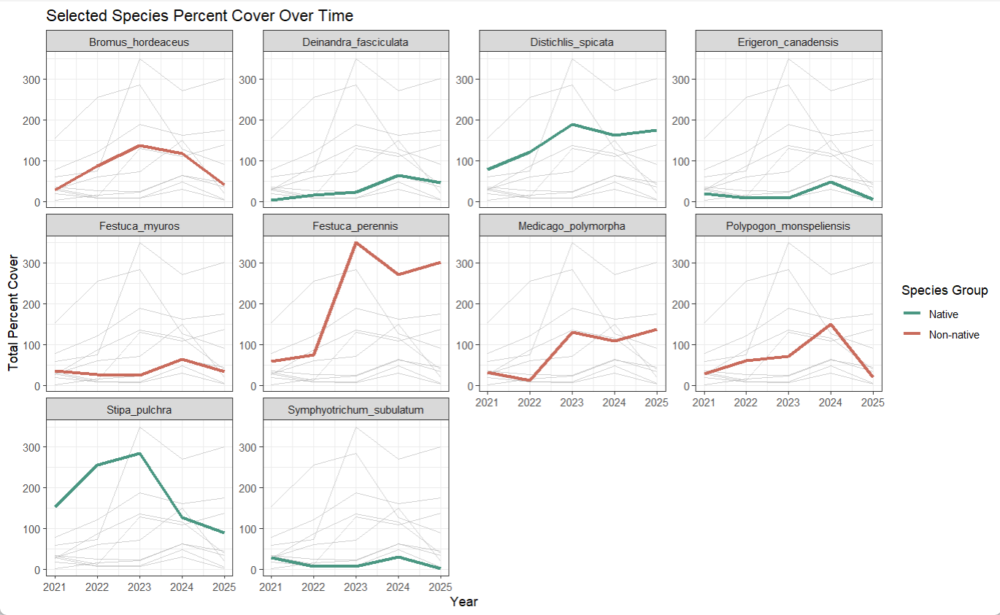

# Ideas for analysis and background
should include some citations (not all)
should include ideas for analyses to answer questions and some preliminary code to run those analyses

# Visualizations directly relevant to answering questions
Our question is: **How has percent cover of key native species and overall native species richness changed through time in grasslands compared to non native species?**

In this figure, each line represents the total percent cover of a particular species of vegetation over time (2021-2025), and each panel represents the trend for one species. On average, native vegetation appears to decrease or maintain their level of percent cover over time while non-native vegetation appears to increase or maintain their level of percent cover over time. This answers part of our question of how native vegetation percent cover has changed over time compared to non-natives: natives decreased or stayed the same, and non-natives increased or stayed the same. 

# Other exploratory visualizations

# Plan for elective

- Final product: trifold brochure made on canva showing: (5) native species of focus in the grassland habitat + two non native species + restoration techniques + history of NCOS
- Would possibly replace online images of plant species with our own if we have the time to go to NCOS and I.D. plants
- Please see our rough draft for the elective brochure in the README:

**Plan**

- Week 8 → finish gathering information on key species + 2 non native key species 
- Week 9 → finish trifold design 
- Week 10 → possibly present *or* finalize details to present during finals week
