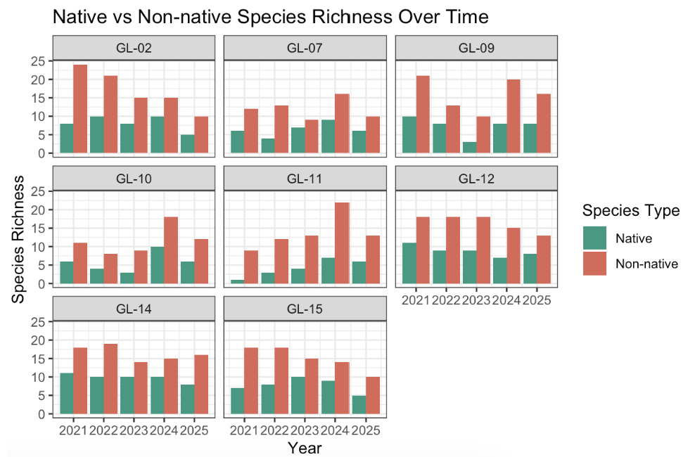
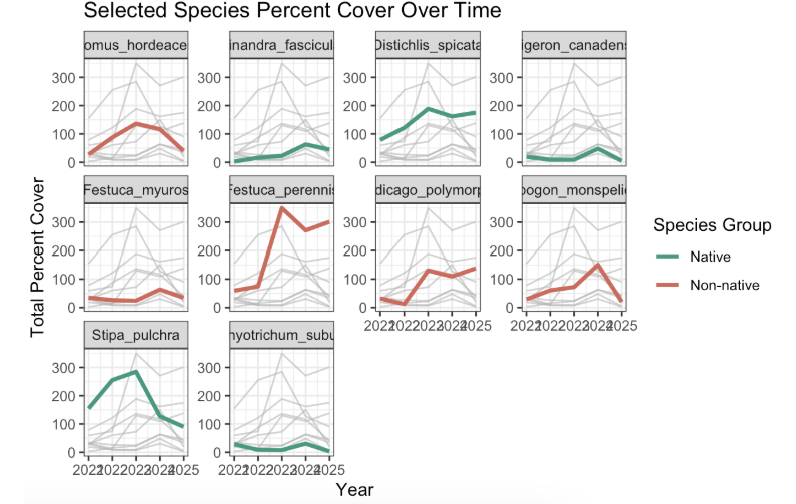
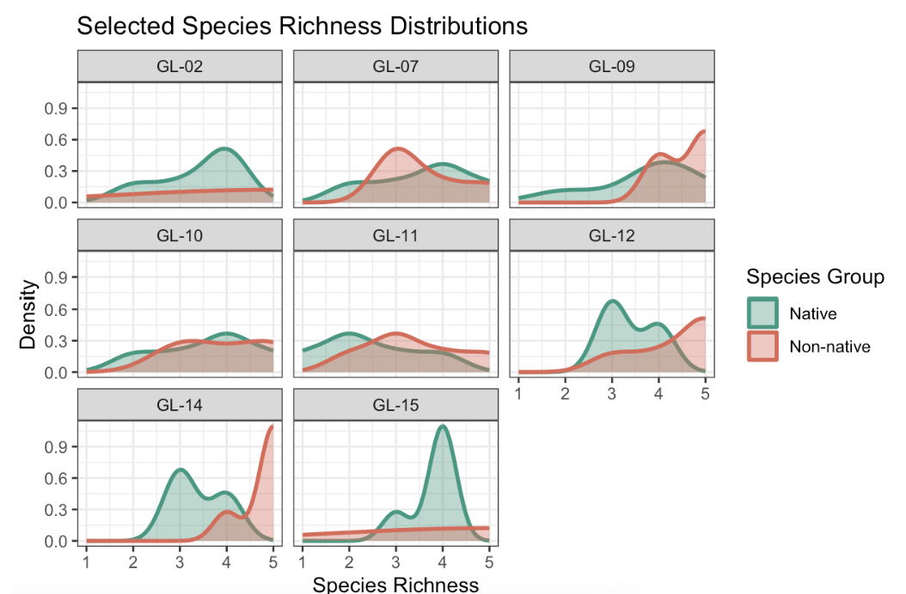
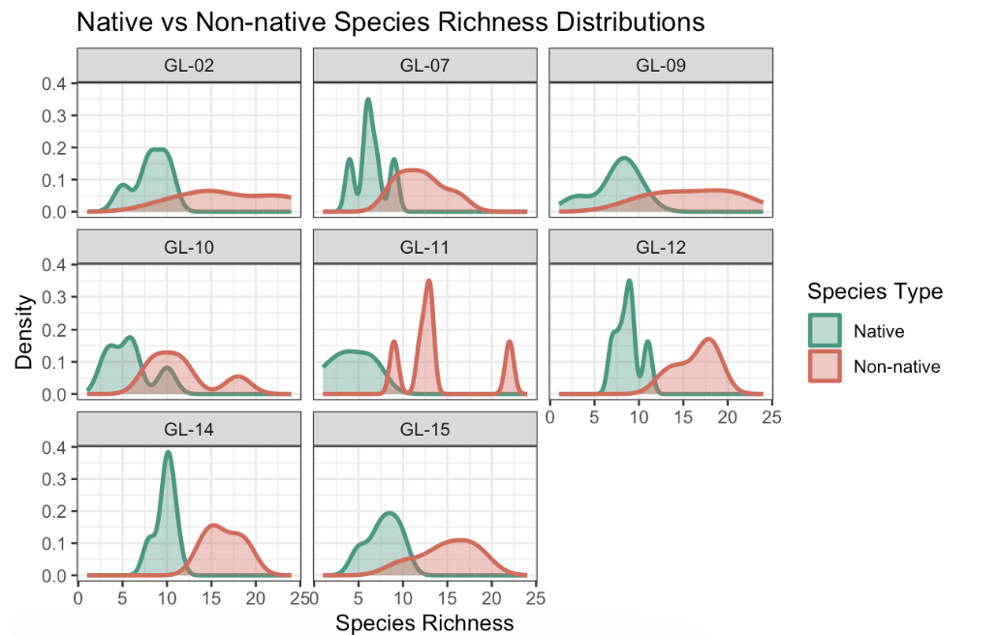
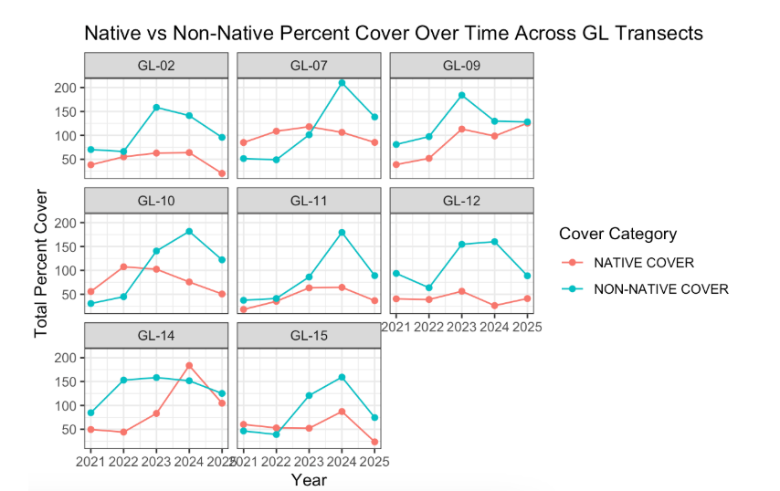

# Ideas for analysis and background

## Background analysis

For our background, we want to look at the history of the open space and how this might have contributed to a need for native restoration as well as invasive species removal. This will relate to our research question of **"how has percent cover of key native species and overall native species richness changed through time in grasslands compared to non native species?"** as historical context will further guide our understanding of change in grassland species composition since the restoration project began. 

## Data analysis

We will not be performing a statistical analysis for our project because we are primarily exploring a correlative relationship rather than predicting trends for species cover and richness. 

## Literature review

Besides analyzing our data, we will need literary resources to inform the nature of our question and why these changes over time are important to wetland habitat's and the overall California landscape. Our literature review will include a mix of peer reviewed journals, the CCBER native plant catalog (found [here](https://www.ncos.ccber.ucsb.edu/native-plant-habitats)), iNaturalist observations and descriptions of plants, and the 2024 monitoring report. These resources may help us to get a more holistic understanding of grassland habitat conservation at NCOS because restoration efforts are one of the primary drivers of change in native species cover and richness here.

# Visualizations 

In this figure, each line represents the total percent cover of a particular species of vegetation over time (2021-2025), and each panel represents the trend for each transect. On average, native species richness appears to maintain a similar level over time while non-native species richness appears to have different trends over time depending on the transect. This answers part of our question of how native species richness has changed over time compared to non-natives: natives stayed the same, and non-natives have spatially varying trends.

In this figure, each line represents the total percent cover of a particular species of vegetation over time (2021-2025), and each panel represents the trend for one species. On average, native vegetation appears to decrease or maintain their level of percent cover over time while non-native vegetation appears to increase or maintain their level of percent cover over time. This answers part of our question of how native vegetation percent cover has changed over time compared to non-natives: natives decreased or stayed the same, and non-natives increased or stayed the same.

## Exploratory visualizations

In this figure, each line represents the total percent cover of a particular native classification of vegetation over time (2021-2025), and each panel represents the trend for one transect. On average, native vegetation appears to increase or maintain their level of percent cover over time while non-native vegetation appears to increase in percent cover over time. This answers part of our question of how native vegetation percent cover has changed over time compared to non-natives: natives increased or stayed the same, and non-natives increased, demonstrating that they don't necessarily move in opposition to each other overall.

# Plan for elective

- Final product: trifold brochure made on canva showing: (5) native species of focus in the grassland habitat + two non native species + restoration techniques + history of NCOS
- Would possibly replace online images of plant species with our own if we have the time to go to NCOS and I.D. plants
- Please see our rough draft for the elective brochure in the README:

**Plan**

- Week 8 → finish gathering information on key species + 2 non native key species 
- Week 9 → finish trifold design 
- Week 10 → possibly present *or* finalize details to present during finals week
