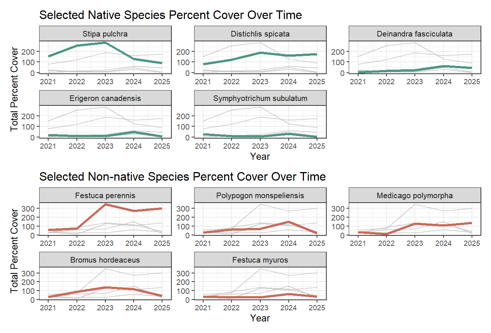
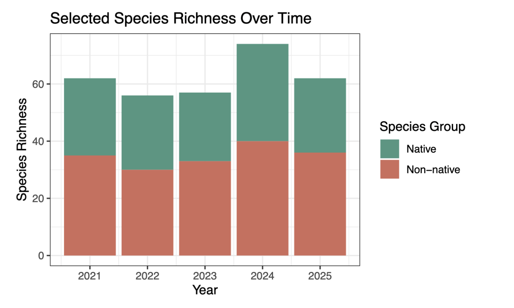
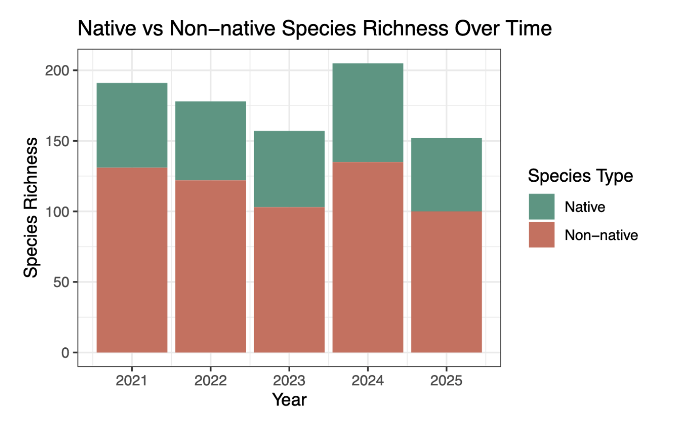

# Ideas for analysis and background

## Background analysis

For our background, we want to look at the history of the open space and how this might have contributed to a need for native restoration as well as invasive species removal. This will relate to our research question of **"how has percent cover of key native species and overall native species richness changed through time in grasslands compared to non native species?"** as historical context will further guide our understanding of change in grassland species composition since the restoration project began. We chose to look at the prescribed fire of Fall 2023 event as a point of analysis, as according to the monitoring report, the clustered tarweed was a native species that positively responded to fire, and we would like to see if this had some effect on other species. 

The native species purple needlegrass (*Stipa pulchra*) and saltgrass (*Distichlis spicata*) were chosen because they frequently came up in the monitoring report as significant recurring native species, and purple needlegrass was identified as a key restoration target species according to the monitoring report. Clustered tarweed (*Deinandra fasciculata*), horseweed (*Erigeron canadensis*), and annual saltmarsh aster (*Symphyotrichum subulatum*) were also chosen because they were good for analysis, as they were present in all eight transects over five years; furthermore, they had many observations as native species. We decided to focus on three forbs and two perennial grasses because it gives us a more balanced restoration picture, as they respond differently to disturbances and stability. For invasive species, we chose perennial ryegrass (*Festuca perennis*) and rabbitfoot grass (*Polypogon monspeliensis*) because these were two species that frequently came up in the monitoring report as the most recurring observed invasive species. We also chose the species soft brome (*Bromus hordeaceus*), rat-tail fescue (*Festuca myuros*), and bur clover (*Medicago polymorpha*) because they were present in all eight transects and in all five years of data, meaning that they were good for data analysis. We chose this variety of species because we wanted to have multiple functional groups with varied ecological responses. We specifically chose bur clover because it is an invasive legume that may alter the soil ecosystem, as it is a nitrogen fixer.

## Data analysis

We will not be performing a statistical analysis for our project because we are primarily exploring a correlative relationship rather than predicting trends for species cover and richness. However, we will be identifying major events/time periods that might contextualize or explain any changes. 

## Literature review

Besides analyzing our data, we will need literary resources to inform the nature of our question and why these changes over time are important to wetland habitat's and the overall California landscape. Our literature review will include a mix of peer reviewed journals, the CCBER native plant catalog (found [here](https://www.ncos.ccber.ucsb.edu/native-plant-habitats)), iNaturalist observations and descriptions of plants, and the 2024 monitoring report. These resources may help us to get a more holistic understanding of grassland habitat conservation at NCOS because restoration efforts are one of the primary drivers of change in native species cover and richness here.

One journal that we found called ["Restoring wetland prairies: tradeoffs among native plant cover, community composition, and ecosystem functioning"](https://esajournals.onlinelibrary.wiley.com/doi/full/10.1890/ES12-00261.1) examines different environmental conditions in which restoration techniques were applied to wetland prairies in Oregon, U.S. Restoration treatments yielded different trade-offs in terms of productivity, soil composition, fungal infection rates. These results could be helpful during our discussion portion where we will make connections to our literature and sections of the CCBER monitoring report, such as `Vegetation Success Criteria`, `Spatial analysis of sediment accumulation and soil carnon storage in a restored wetland`, and `Vegetation Monitoring Data`. This can inform us in why patterns in species cover and species richness occur the way they do over time, perhaps based on the type of restoration techniques that were applied to the grassland habitat. 

# Visualizations 

In this figure, each bar represents the total species richness of a particular year, and each panel represents the temporal trend for each transect. On average, native species richness appears to maintain a similar level over time while non-native species richness appears to have different trends over time depending on the transect. There also appears to consistently be a larger proportion of non-native species to native species in each transect. This answers part of our question of how native species richness has changed over time compared to non-natives: natives stayed the same, and non-natives have spatially varying trends.

In this figure, each line represents the total percent cover of a particular species of vegetation over time (2021-2025), and each panel represents the trend for one species. On average, native vegetation appears to decrease or maintain their level of percent cover over time while non-native vegetation appears to increase or maintain their level of percent cover over time. This answers part of our question of how native vegetation percent cover has changed over time compared to non-natives: natives decreased or stayed the same, and non-natives increased or stayed the same.

## Exploratory visualizations

This figure compares *selected* native and non-native species richness over time using a stacked bar plot. The graph shows the total richness of the native and non-native species groups we selected across all transects from 2021–2025. Overall, non-native species richness remains slightly higher than native species richness throughout observations.

Species richness decreases somewhat between 2021 and 2022, stays fairly similar in 2023, increases in 2024, and then drops again in 2025. Native species richness stays relatively consistent across the years, while non-native species richness makes up a larger portion of the total richness in each year. Compared to the previous density plot, this visualization is more useful for our project because it shows temporal changes more clearly and helps us better evaluate patterns in restoration and shifts in native versus non-native plant communities over time.

This figure compares native and non-native species richness over time for *all* species observed in the grassland habitat using a stacked bar plot. Across every year, invasive species richness is higher than native species richness, inferring that invasive plants make up a larger portion of the grassland ecosystem throughout observation years.

Both native and invasive richness follow similar trends over time. Species richness decreases from 2021 to 2023, increases substantially in 2024, and then declines again in 2025. Although native richness remains substantial across all years, invasive richness consistently contributes the larger share of total richness.

Compared to the previous density plot, this visualization is more effective for answering our research question because it allows us to directly examine temporal patterns in species richness. The graph also highlights the continued dominance of non-native species within the grassland habitat, which may suggest that restoration efforts are occurring alongside persistent invasive species presence.

In this figure, each line represents the total percent cover of a particular native classification of vegetation over time (2021-2025), and each panel represents the trend for one transect. On average, native vegetation appears to increase or maintain their level of percent cover over time while non-native vegetation appears to increase in percent cover over time. This answers part of our question of how native vegetation percent cover has changed over time compared to non-natives: natives increased or stayed the same, and non-natives increased, demonstrating that they don't necessarily move in opposition to each other overall.

# Plan for elective

- Final product: trifold brochure made on canva showing: (5) native species of focus in the grassland habitat + two non native species + restoration techniques + history of NCOS
- Would possibly replace online images of plant species with our own if we have the time to go to NCOS and I.D. plants
- Please see our rough draft for the elective brochure in the **README**

**Plan**

- Week 8 → finish gathering information on key species + 2 non native key species 
- Week 9 → finish trifold design 
- Week 10 → possibly present *or* finalize details to present during finals week
